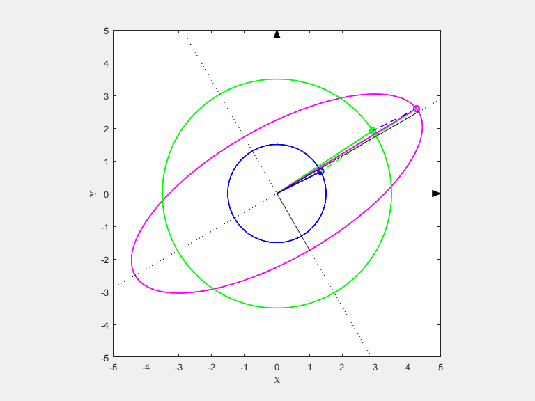

# 利用将Matlab 绘图保存为gif动态图
参考[Python 和MATLAB 制作Gif 图像](https://zhuanlan.zhihu.com/p/87380652)

Matlab 核心实现代码
```m
    F=getframe(gcf);
    I=frame2im(F);
    [I,map]=rgb2ind(I,256);
    if pic_num == 1
        imwrite(I,map,'test1.gif','gif', 'Loopcount',inf,'DelayTime',0.1);
    else
        imwrite(I,map,'test1.gif','gif','WriteMode','append','DelayTime',0.1);
    end
    pic_num = pic_num + 1;
```

使用效果



[🔙返回主目录](./MatlabNodeList.md)
